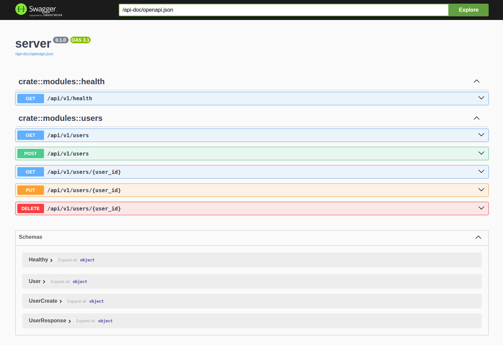

# Axum + Postgres Application Boilerplate

This repository contains an application template built using [Axum](https://github.com/tokio-rs/axum) and [PostgreSQL](https://www.postgresql.org/). It serves as a starting point for creating a new Axum server.

<center>GraphQL</center>


<center>Swagger</center>




The full list of crates used can be found in the [Cargo.toml](./Cargo.toml) file. However, here are some key ones:

- [Axum](https://github.com/tokio-rs/axum) - A user-friendly, modular web framework built with Tokio, Tower, and Hyper.
- [Sea-ORM](https://github.com/SeaQL/sea-orm) - An async & dynamic ORM for Rust, supporting PostgreSQL, MySQL, SQLite, and MSSQL.
- [Tracing](https://github.com/tokio-rs/tracing) - A framework for instrumenting Rust programs to collect structured, event-based diagnostic information.
- [Chrono](https://github.com/chronotope/chrono) - A comprehensive Date and Time library for Rust.
- [Serde](https://serde.rs/) - A framework for efficiently and generically serializing and deserializing Rust data structures.
- [Uuid](https://github.com/uuid-rs/uuid) - A library for generating and parsing UUIDs.

## Features

- **Project Structure**
  - [x] Modular Axum + PostgreSQL setup
  - [x] Environment-based configuration
  - [x] Docker support

- **Database**
  - [x] Sea-ORM integration
  - [x] Database migrations

- **API**
  - [x] REST endpoints
  - [x] GraphQL support
  - [x] API versioning
  - [x] OpenAPI/Swagger documentation

- **Authentication & Authorization**
  - [x] JWT authentication
  - [x] Role-based access control (RBAC)

- **Error Handling & Logging**
  - [x] Centralized error handling
  - [x] Logging with Tracing

- **Testing**
  - [ ] Unit tests
  - [ ] Integration tests
  - [ ] API tests

- **Security**
  - [ ] Rate limiting
  - [ ] CORS configuration
  - [ ] Input validation

- **Monitoring & Observability**
  - [ ] Metrics collection
  - [ ] Health checks
  - [ ] Performance monitoring

- **Developer Experience**
  - [ ] Code generation tools
  - [ ] Development scripts
  - [ ] CI/CD pipeline configuration

## Getting Started

To begin with this project:

### Install `sea-orm-cli`

Sea-ORM offers a command-line tool for creating and managing databases as well as migrations. It is available on the Cargo crates registry as `sea-orm-cli` and can be installed as follows:

```shell
$ cargo install sea-orm-cli
```

### Run Postgres

The most straightforward way to run Postgres is by using a container with a pre-built image. The command below will start latest version of Postgres using [Docker](https://www.docker.com/):

```shell
$ docker run -d -p 5432:5432 -e POSTGRES_PASSWORD=password postgres
```

### Clone this Repository

```shell
$ git clone https://github.com/nakamuraos/axum-postgres-boilerplate
$ cd axum-postgres-boilerplate
```

### Configure the Application

The backend application is preferably configured via environment variables. To simplify the process during development, we can use `.env` files to avoid defining the variables each time. As a starting point, you can simply copy the sample `.env` file in this repo and modify the `.env` file as per the comments therein.

```shell
$ cp .env.sample .env
```

### Set Up the Application Database

With `sea-orm-cli` installed and your `.env` file set up, you can prepare the Postgres database for use:

```shell
$ sea-orm-cli migrate up
```

### Starting the Application

With everything else set up, all you need to do now is:

```shell
$ cargo run
```

- The application will be available at http://localhost:8080
  - Swagger: http://localhost:8080/docs
  - GraphQL: http://localhost:8080/graphql

### Autoreloading

To start the server and autoreload on code changes:

```shell
$ cargo install cargo-watch
$ cargo watch -q -x run
```

To format `.json` logs using [`jq`](https://github.com/jqlang/jq):

```shell
$ cargo watch -q -x run | jq .
```

## Running with Docker Compose

This project includes Docker Compose configuration for easy development and deployment. To run the application using Docker Compose:

1. Make sure you have Docker and Docker Compose installed on your system.

2. Copy the sample environment file:
```shell
$ cp .env.sample .env
```

3. Start the application and its dependencies (PostgreSQL):
```shell
$ docker-compose up
```

To run in detached mode (in the background):
```shell
$ docker-compose up -d
```

To stop the application:
```shell
$ docker-compose down
```

The application will be available at `http://localhost:8080`, and PostgreSQL will be accessible on port 5432.

## Contributing

Contributions are always welcome! Feel free to check the current issues in this repository for tasks that need attention. If you find something missing or that could be improved, please open a new issue.
